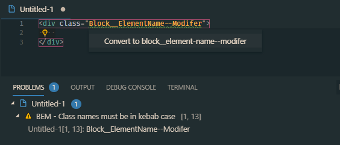

# BEM Helper

A VSCode extension to help when using the [BEM (Block-Element-Modifier)](http://getbem.com/naming) class naming convention in HTML.

Get it on the [VSCode Marketplace](https://marketplace.visualstudio.com/items?itemName=Box-Of-Hats.bemhelper).

Got any feedback, issues or feature requests? Send them my way via [GitHub Issues](https://github.com/Box-Of-Hats/Bem-VSCode-Extension/issues/new).

## Commands

| Command name                 | Description                                                                             | Shortcut  |
| ---------------------------- | --------------------------------------------------------------------------------------- | --------- |
| bemHelper.insertBemElement   | Insert a new BEM element under the current block                                        | alt + b e |
| bemHelper.insertBemModifier  | Insert a new BEM modified element, copying the classname prefix of the previous element | alt + b m |
| bemHelper.generateStyleSheet | Generate a new file containing CSS/LESS/SCSS for the current HTML file                  | alt + b s |

## Diagnostic Help

BEM helper provides warnings when class names are in violation of BEM naming standards.

### Classes not following BEM standards

### Classes not following the specified case

A quick fix is included to make fixing case name issues quicker.

## Inserting Elements

Both regular and modified element snippets can be inserted which already contain the parent class prefix. By default, these commands are bound to **`alt + b e`** (`insertBemElement`) and **`alt + b m`** (`insertBemModifier`), but they can be modified inside of the VSCode keyboard shortcuts menu.

## Generating LESS / SCSS / CSS

Generate stylesheets from your BEM markup using the `generateStylesheet` command. When using LESS or SCSS, the classnames will be appropriately nested and ready for you to start styling.

If you don't like fancy pre-processors, you can also generate plain CSS.

