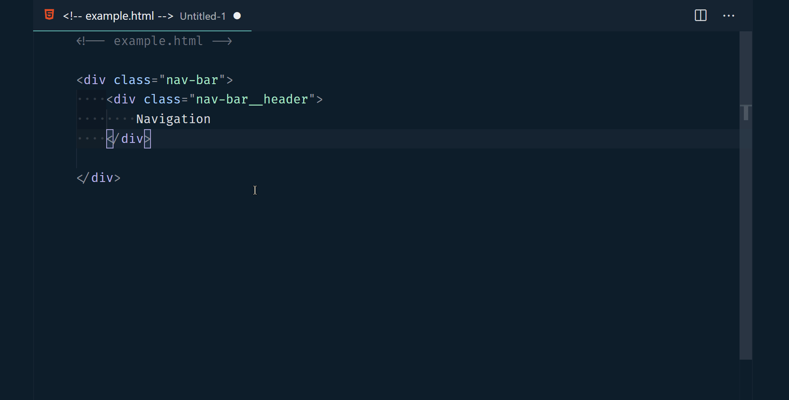

# BEM Helper

A VSCode extension to help when using the [BEM (Block-Element-Modifier)](http://getbem.com/naming) class naming convention in HTML.

## Commands

| Command name                 | Description                                                                      |
| ---------------------------- | -------------------------------------------------------------------------------- |
| bemHelper.insertBemElement   | Insert a new BEM element under the current block                                 |
| bemHelper.insertBemModifier  | Insert a new BEM modified element, copying the classname of the previous element |
| bemHelper.generateStyleSheet | Generate a new file containing CSS for the current HTML file                     |

## Diagnostic Help

BEM helper provides warnings when class names are in violation of BEM naming standards.

## Inserting Example

## Known issues

-   Classes wont be discovered if they contain \_ characters.
