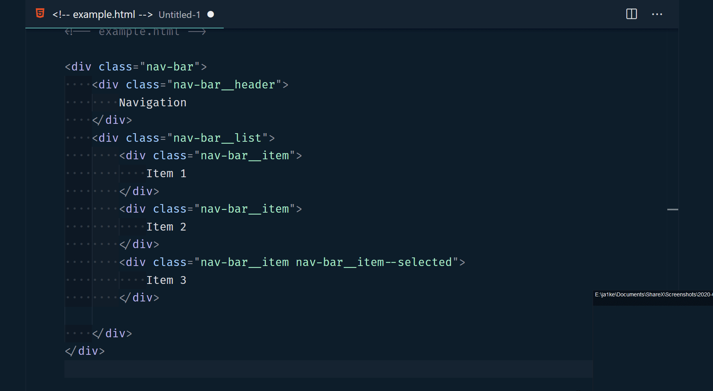

# BEM Helper

A VSCode extension to help when using the [BEM (Block-Element-Modifier)](http://getbem.com/naming) class naming convention in HTML.

## Commands

| Command name                 | Description                                                                      | Shortcut  |
| ---------------------------- | -------------------------------------------------------------------------------- | --------- |
| bemHelper.insertBemElement   | Insert a new BEM element under the current block                                 | alt + b e |
| bemHelper.insertBemModifier  | Insert a new BEM modified element, copying the classname of the previous element | alt + b m |
| bemHelper.generateStyleSheet | Generate a new file containing CSS/LESS/SCSS for the current HTML file           | alt + b s |

## Diagnostic Help

BEM helper provides warnings when class names are in violation of BEM naming standards.

## Inserting Elements

## Generating LESS / SCSS / CSS

## Known issues

-   Classes wont be discovered if they contain \_ characters.
-   Inserting a modifier after another modified element not functioning