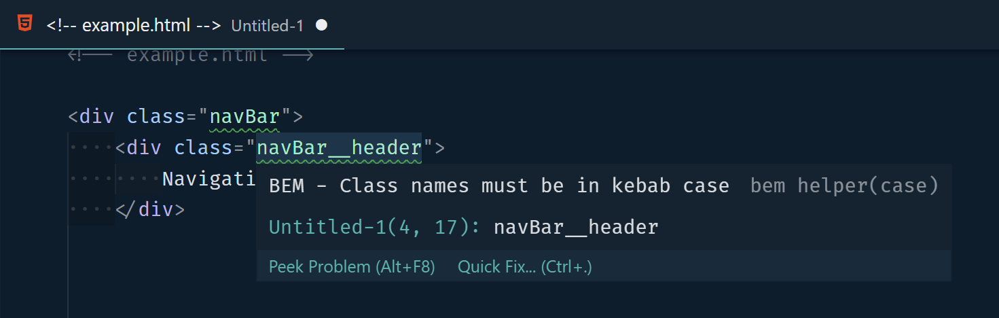

# BEM Helper

A VSCode extension to help when using the [BEM (Block-Element-Modifier)](http://getbem.com/naming) class naming convention in HTML.

## Commands

- extension.insertBemElement
- extension.insertBemModifier

## Diagnostic Help

BEM helper provides warnings when class names are in violation of BEM naming standards.



## Inserting Example


```html
<div class="nav-bar">
    <div class="nav-bar__item">One</div>
    <div class="nav-bar__item">Two</div>
    <div class="nav-bar__item nav-bar__item--wide">
        <div class="nav-bar__title">
            Three
        </div>
        <div class="nav-bar__body">
            This is item number 3
        </div>
    </div>
</div>
```

## Known issues

- Classes wont be discovered if they contain _ characters.