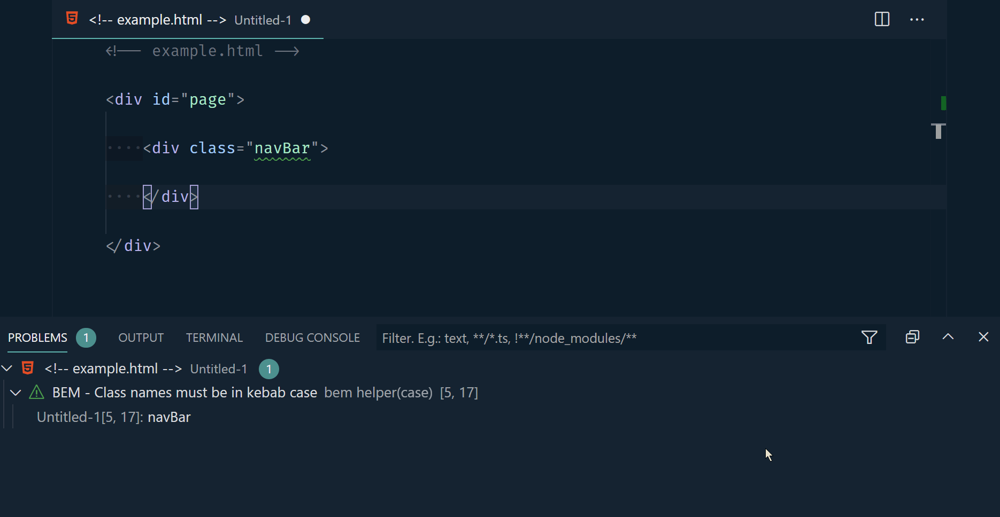

# BEM Helper

A VSCode extension to help when using the [BEM (Block-Element-Modifier)](http://getbem.com/naming) class naming convention in HTML.

Get it on the [VSCode Marketplace](https://marketplace.visualstudio.com/items?itemName=Box-Of-Hats.bemhelper).

Got any feedback, issues or feature requests? Send them my way via [GitHub Issues](https://github.com/Box-Of-Hats/Bem-VSCode-Extension/issues/new).

- [BEM Helper](#bem-helper)
  - [Language Support](#language-support)
  - [Commands](#commands)
  - [Settings](#settings)
  - [Generating LESS / SCSS / CSS](#generating-less--scss--css)
  - [Inserting Elements](#inserting-elements)
  - [Diagnostic Help](#diagnostic-help)
    - [Classes not following BEM standards](#classes-not-following-bem-standards)
    - [Classes not following the specified case](#classes-not-following-the-specified-case)

## Language Support

Currently, the languages that are officially supported are:

-   HTML
-   React (Jsx)
-   React (Tsx)
-   Razor (.net core / framework)
-   Vue
-   PHP

If there are any languages that you want support added for then please open a [github issue](https://github.com/Box-Of-Hats/Bem-VSCode-Extension/issues/new)

## Commands

| Command name                              | Description                                                                             | Shortcut  |
| ----------------------------------------- | --------------------------------------------------------------------------------------- | --------- |
| bemHelper.insertBemElement                | Insert a new BEM element under the current block                                        | alt + b e |
| bemHelper.insertBemModifier               | Insert a new BEM modified element, copying the classname prefix of the previous element | alt + b m |
| bemHelper.insertClassName                 | Insert a BEM classname in the current cursor position                                   | alt + b c |
| bemHelper.generateStyleSheet              | Generate a new file containing CSS/LESS/SCSS for the current HTML file                  | alt + b s |
| bemHelper.generateStyleSheetFromSelection | Generate a new file containing CSS/LESS/SCSS for the current selected elements          |           |
| bemHelper.convertSelectionToCase          | Convert the current text selection to a given case                                      |           |

## Settings

| Setting                            | Description                                                                                                                    | Allowed Values                                  |
| ---------------------------------- | ------------------------------------------------------------------------------------------------------------------------------ | ----------------------------------------------- |
| bemHelper.classNameCase            | The allowed case styling of class names. Can be a single value or a list of values, separated by commas (e.g `"kebab,snake"`)  | any, kebab, snake, camel, pascal, shoutingSnake |
| bemHelper.responsiveLinting        | Enable/disable linting checks whenever a file contents changes. Disable for increased performace. Reload window to take effect | true, false                                     |
| bemHelper.showDepthWarnings        | Enable/disable depth warnings. e.g block\_\_block2\_\_element                                                                  | true, false                                     |
| bemHelper.elementSeparator         | The string to use as a separator for elements. By default is set to `__`. Reload window to take effect                         | any string                                      |
| bemHelper.modifierSeparator        | The string to use as a separator for modifiers. By default is set to `--`. Reload window to take effect                        | any string                                      |
| bemHelper.sortGeneratedStylesheets | Controls whether generated stylesheets should be sorted alphabetically                                                         | true, false                                     |
| bemHelper.maxWarningsCount         | The maximum number of diagnostic warnings to show. Defaults to 100.                                                            | number                                          |
| bemHelper.ignoreClassNames         | A list of class names that should be ignored as parents (blocks) when inserting new elements or when generating a stylesheet.  | A list of strings                               |
| bemHelper.blockSelectionMode       | The method to use for selecting a parent block when inserting elements                                                         | prefer-explicit, first-parent, explicit-only    |
| bemHelper.newLineAfterInsert       | Should a newline be inserted after inserting an element?                                                                       | true, false                                     |
| bemHelper.languages                | The list of languages for which the diagnostics should be enabled                                                              | string[]                                        |

## Generating LESS / SCSS / CSS

Generate stylesheets from your BEM markup using the `generateStylesheet` command. When using LESS or SCSS, the classnames will be appropriately nested and ready for you to start styling.

If you don't like fancy pre-processors, you can also generate plain CSS.

## Inserting Elements

Both regular and modified element snippets can be inserted which already contain the parent class prefix. By default, these commands are bound to **`alt + b e`** (`insertBemElement`) and **`alt + b m`** (`insertBemModifier`), but they can be modified inside of the VSCode keyboard shortcuts menu.

## Diagnostic Help

BEM helper provides warnings when class names are in violation of BEM naming standards.

### Classes not following BEM standards

### Classes not following the specified case

A quick fix is included to make fixing case name issues quicker.

You can specify your preferred casing in the extension settings using `bemHelper.classNameCase`.

